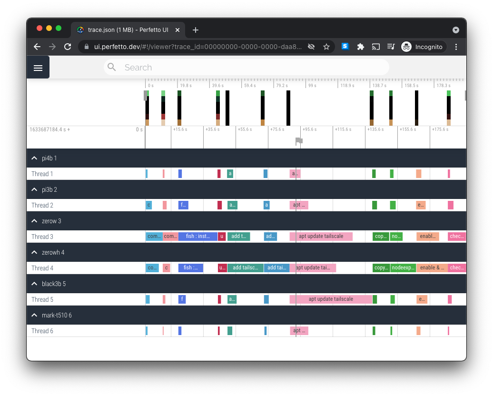
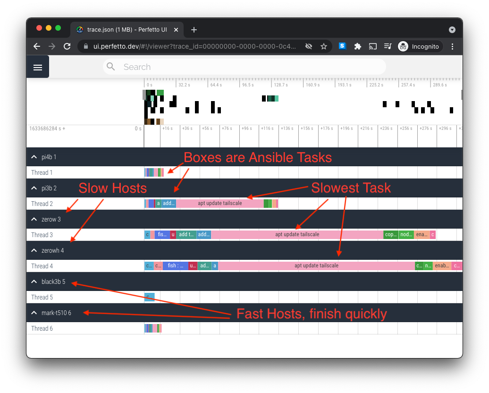
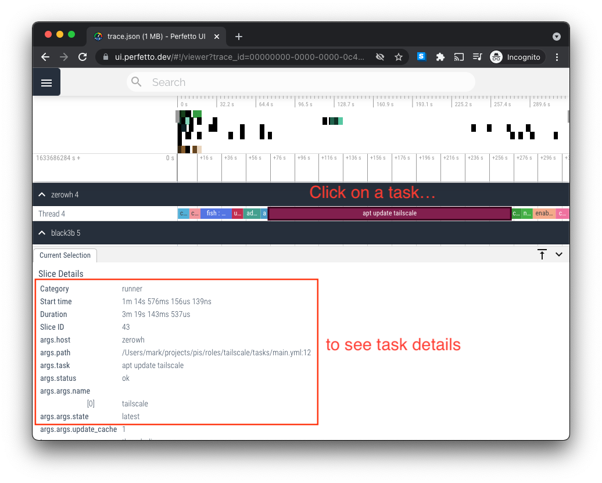

# ansible-trace

Visualise where time spent in your Ansible playbooks: what tasks, and what hosts, so you can find where to optimise and decrease playbook latency.

An Ansible [Callback Function](https://docs.ansible.com/ansible/latest/plugins/callback.html) which traces the execution time of Ansible playooks, outputting [Chrome's Trace Event Format](https://docs.google.com/document/d/1CvAClvFfyA5R-PhYUmn5OOQtYMH4h6I0nSsKchNAySU/preview) for visualising in the [Perfetto](https://ui.perfetto.dev/) in-browser trace UI.

Here's a trace of me deploying to my home Raspberry Pi cluster, with the default [`strategy: linear`](https://docs.ansible.com/ansible/latest/collections/ansible/builtin/linear_strategy.html#linear-strategy). You can see that now all the tasks are synchronized across hosts, with each host waiting for the slowest host before proceeding to the next task:



Here's the same playbook ran with [`strategy: free`](https://docs.ansible.com/ansible/latest/collections/ansible/builtin/free_strategy.html) so fast hosts run to completion without waiting for slow hosts:



You can click on tasks to see details about them:



## Usage

1.  Copy `trace.py` into your Ansible's `callback_plugins` directory, or in [other positions Ansible accepts](https://docs.ansible.com/ansible/latest/plugins/callback.html#enabling-callback-plugins), e.g.:

    ```
    ansible-root
    ├── ansible.cfg
    ├── site.yml
    └── callback_plugins
        └── trace.py
    ```

1.  Enable the `trace` callback plugin in your `ansible.cfg`:

    ```ini
    [defaults]
    callback_enabled = trace
    ```

    Or, enable it at the top of your playbook yml:

    ```yml
    ansible:
      env:
        CALLBACKS_ENABLED: trace
        TRACE_OUTPUT_DIR: .
        TRACE_HIDE_TASK_ARGUMENTS: True
    ```

1.  Run your Ansible Playbook:

    ```shell
    $ ansible-playbook site.yml
    ```

    This will output `trace.json` in the `TRACE_OUTPUT_DIR`, defaulting to your current working directory.

1.  Open https://ui.perfetto.dev/, and drag-and-drop in the `trace.json`.
    
    You don't have to wait for the trace to finish; you can open in-progress trace files.

## Other Ansible Profiling Tools

### profile_tasks

[`ansible.posix.profile_tasks`](https://docs.ansible.com/ansible/latest/collections/ansible/posix/profile_tasks_callback.html) displays task timing as console output, but can't visualise gaps in the timing (e.g. with `strategy: linear` when fast hosts wait for slow hosts).

### ansible-playbook -vvvv

[Adding extra `v`s adds more debug info](https://docs.ansible.com/ansible/latest/cli/ansible-playbook.html#cmdoption-ansible-playbook-v), `-vvvv` enables connection debugging.

### Mitogen for Ansible

[Mitogen](https://mitogen.networkgenomics.com/ansible_detailed.html) promises to speed up your Ansible playbooks with a persistent interpreter. They profile their runs for bandwidth an time by analysing network packet captures.

You need to install from HEAD to support latest Ansible versions, because there hasn't been a tagged release since 2019.
